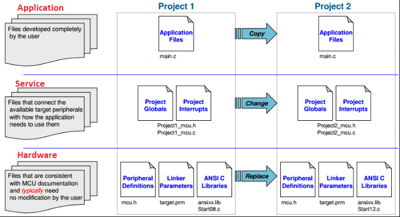

# Kr Firmware framework
> framework cho lập trình các ứng dụng embedded, tối ưu hóa việc sử dụng lại khi thay đổi nền tảng hardware

Vấn đề trong việc phát triển phần mềm cho embedded system là việc phụ thuộc vào phần cứng. Mỗi chip của các hãng khác nhau lại có những thư viện riêng, do đó khi thay đổi nền tảng phần cứng  sẽ rất khó khăn trong việc sử dụng lại. Do đó, yêu cầu phải đưa ra một kiến trúc phần mềm phù hợp, chia chương trình thành những tầng có chức năng riêng biệt, dễ quản lý, bảo trì soát lỗi. Hơn nữa nó tối ưu hóa tính sử dụng lại của chương trình khi thay đổi nền tảng phần cứng.

Kiến trúc phần mềm được đưa ra gồm 3 tầng như sau

* Hardware: Chứa các phần source code riêng biệt cho từng nền tảng phần cứng và không thể thay đổi theo ý người phát triển. Các source code này thường được cung cấp bởi hãng cung cấp giải pháp dưới dạng các driver cho chức năng cơ bản GPIO, UART, Timer, I2C..., tóm lại  nó dùng để thiết lập các chế độ hoạt động của từng nền tảng phần cứng.

* Service: Chứa các phần source code được trừu tượng hóa, cài đặt các thuật toán nâng cao và không phụ thuộc phần cứng. Đây là phần chuyển tiếp giữa tầng dưới (Hardware) và tầng ứng dụng. Nó sử dụng các hàm từ tầng Hardware và đưa ra các API cho tầng ứng dụng.

* Application:  Chứa phần cài đặt cho từng ứng dụng cụ thể, tầng này sử dụng các API từ tầng Translation và hạn chế truy cập trực tiếp phần cứng.



Nếu cài đặt đúng theo kiến trúc như trên, khi chuyển đổi nền tảng phần cứng ta sẽ tối ưu sử dụng lại source code mà không phải viết lại từ đầu.
* Tầng Hardware do phụ thuộc hoàn toàn đối với từng nền tảng nên sẽ bị thay thế bằng nền tảng mới.
* Tầng  Service sẽ được chỉnh sửa lại cho phù hợp với nền tảng mới (thêm bớt modue so với nền tảng cũ).
* Tầng Application có thể giữ nguyên.

## Installation

Dùng gcc để build cho các dòng arm. Để cài đặt có thể dùng lệnh với ubuntu như sau

```sh
apt-get install gcc-arm-linux-gnueabi binutils-arm-linux-gnueabi
```
Kiểm tra bằng lệnh

```sh
arm-none-eabi-gcc --version
```

Do project demo cài đặt cho dòng STM32F0 nên có thể setup môi trường theo hướng dẫn ở link sau
[STM32F0-Discovery Application Template]:https://github.com/szczys/stm32f0-discovery-basic-template

Build project theo make file kèm theo project

## Usage example

Tầng hardware đã được cài đặt theo interface chung, do đó ta có thể sử dụng lại mà không cần  chỉnh sửa. Ví dụ phần test sau sử dụng chung cho cả test board MSP430 và STM32F0

```sh
/*Test io*/

#define PRESS_BUTTON (10) // press button event

uint8_t LED_GREEN  = GPIO_PIN(GPIO_PC, 9);
uint8_t LED_BLUE   = GPIO_PIN(GPIO_PC, 8);
uint8_t BUTTON     = GPIO_PIN(GPIO_PA, 0);

void pulse_led(void* param);

void button_press_cb(void* param);

void gpio_test(void)
{
    uart_printf("\nTesting io ...");
    gpio_init(LED_GREEN, GPIO_OUT);
    gpio_init(LED_BLUE, GPIO_OUT);

    g_test_ok = FALSE;
    uart_printf("\n    Turning on LED_BLUE...");
    delay_ms(500);
    gpio_set(LED_BLUE);
    uart_printf("\n    Please get_confirm (press 'y')...");
    while (!g_test_ok);

    g_test_ok = FALSE;
    uart_printf("\n    Registing button to toggle LED_GREEN ...");
    gpio_init_irq(BUTTON, GPIO_FALLING);
    gpio_irq_register_callback(button_press_cb);
    delay_ms(500);
    uart_printf("\n    Please get_confirm (press 'y')...");
    while (!g_test_ok);

    uart_printf("\n    io function is ok :D");
}
```
## Release History
* 0.0.1
    * Work in progress

## Meta

KienLTb – letrungkien.k53.hut@gmail.com

Distributed under the MIT license.
